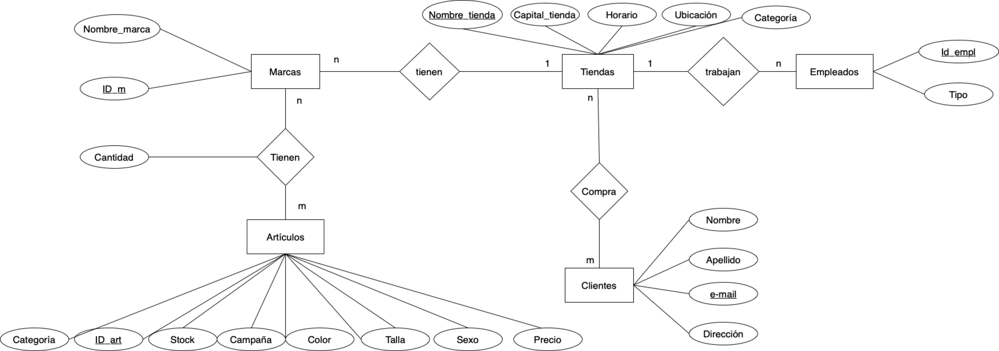
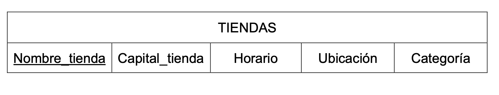
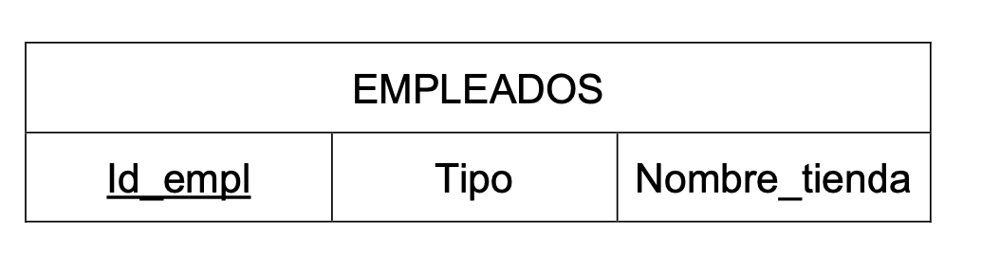
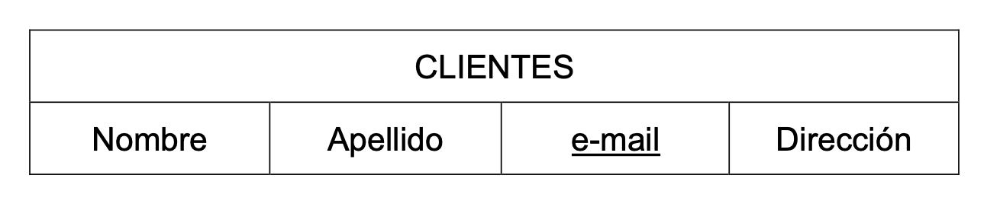
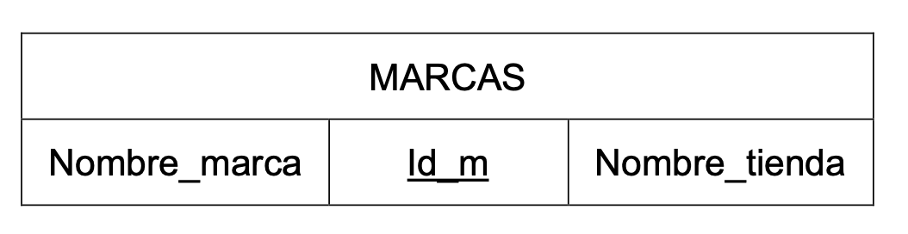
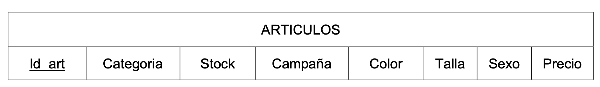

# Proyecto-TIS

---

## Presentación del proyecto

Nuestro proyecto consiste en hacer una base de datos de una cadena de boutiques multimarca de lujo, cada una con su determinado tipo de articulos a la venta como pueden ser: calzado de hombre, calzado de mujer y accesorios, ropa de mujer o ropa de hombre.

## Diagrama UML de casos de uso

En nuestro diagrama UML tenemos 3 objetos
-Actores
-Casos de uso
-Sistema
Procederemos a la explicación detallada de cada uno de ellos.

Primeramente, en nuestro diagrama observamos la existencia de tres actores que desempeñan diferentes papeles:

El cliente: Al tratarse de un grupo de tiendas, necesitamos tener clientes que compren en cada una de ellas.
El empresario: Se trata de una empresa y por lo tanto es necesaria una figura como la del empresario que se encargue de gestionar las necesidades de la empresa y el que llevará nuestra base de datos.
Y, por último, un proveedor, el cuál aportará mercancía a la tienda.

A continuación, comentamos los casos de uso de nuestro sistema.
Son acciones que realizan nuestros actores y se representan como óvalos.

Los actores están asociados con casos de uso.
El Cliente tiene tres asociaciones con casos de uso, que son: 
-Comprar, el cliente compra artículos.
-Devolución, el cliente puede devolver un artículo y que se le devuelva el dinero.
-Cambio, el cliente puede intercambiar un artículo por otro.

El Empresario tiene tres asociaciones con casos de uso:
-Vende, el empresario vende artículos a los clientes.
-Paga, el empresario paga al proveedor por la mercancía
-Actualiza Stock, el empresario es el encargado de registrar los cambios referidos al stock de artículos.

El Proveedor tiene dos asociaciones de casos de uso:
-Suministra mercancía, el proveedor es el encargado de aportar mercancía a nuestras tiendas.
-Cobra, el proveedor cobra por suministrar mercancía.

Observamos una dependencia entre el caso de uso Paga, del Empresario y el caso de uso Cobra, del Proveedor. Por ello aparecen asociados mediante un <<a>> indicando que el Empresario paga al Proveedor y que este Cobra

Por último, nuestro sistema (ZR FASHION) que lo utilizamos para definir el alcance de los casos de uso y aparece representado como un rectángulo.
 
 

## Diagrama entidad - relación y tablas

Presentamos el diagrama entidad relación de nuestro proyecto. 

 

En el se pueden observar 5 entidades con sus correspondientes atributos y 4 relaciones. 
 
La primera entidad a destacar es “Tienda” que cuenta con los atributos propios de una tienda convencional, como  “Nombre_tienda”, “Horario” o “Ubicación”, todos datos no nulos excepto “ubicación”. Además, dado que en nuestro proyecto trabajamos sobre la idea de una cadena de boutiques multimarca de lujo, cada tienda contará con su determinada “Categoría” no nula, como por ejemplo, “ropa de mujer”, “complementos”… etch, de tal forma que cada tienda venderá artículos de una única categoría. 
Otra de las entidades de nuestro diagrama son las “Marcas” que, a parte de su nombre, contaran con un atributo identificativo y único, un ID. 
Como no podría faltar en una tienda, se venderán “Artículos”, que será otra entidad que contará con múltiples atributos, como “Color”, “Talla”, “Sexo” …etc. 
Como en cualquier tienda, contaremos con una serie de “Clientes” a quienes registraremos a partir de sus datos personales, representados como atributos de nuestra entidad. 
Por último, contaremos con una serie de empleados en cada tienda que se encargaran de administrar el local. 
 
Por otra parte, como ya comentábamos, contamos con 4 relaciones entre las distintas entidades. Las dos primeras son relaciones del tipo n-m:  entre “Tiendas” y “Clientes”, que justifica la acción de comprar de los clientes en las diversas tiendas; y otra entre “Marcas” y “Artículos”, ya que múltiples marcas cuentan con múltiples artículos distintos. Posteriormente tenemos dos relaciones 1-n, la primera relaciona a los diversos “Empleados” de una tienda, con la “Tienda” en cuestión donde trabajan; la segunda, verifica la característica multimarca de las tiendas de nuestro proyecto, ya que se establece que  una “Tienda” tiene múltiples “Marcas”. 
 
Paso a tablas: 
 
En el proceso de paso a tablas partiendo del diagrama entidad relación hay que tener en cuenta el número de entidades así como los tipos de relaciones. 
 
Cada entidad será una tabla. Además cada relación n-m será una nueva tabla que contendrá las claves primarias de las dos entidades a las que hace referencia la relación. 
 
También hay que tener en cuenta que en las relaciones 1-n, la clave primaria de la entidad con cardinalidad 1 se añade como clave ajena a la tabla de la entidad con cardinalidad n. 

Con todo esto, las tablas que se extraen de nuestro diagrama son las siguientes:

 

 

 

 

 

 

 
